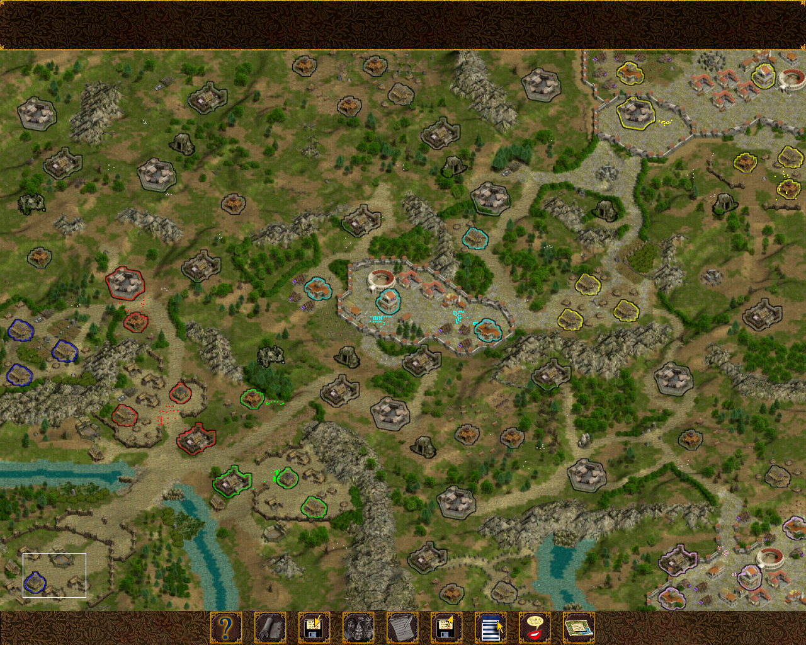

# Imperivm 1 - La Amenaza Teutón

### Sobre el mod
[https://josueca.github.io](https://josueca.github.io)

### Descargar el mod
[https://github.com/JosueCA/La-Amenaza-Teuton/releases/](https://github.com/JosueCA/La-Amenaza-Teuton/releases/)

### Escenarios para el mod

#### - AnotherWar

    

#### - Cuatro Reinos MOD

    

#### - La batalla de Stonehenge MOD

    

